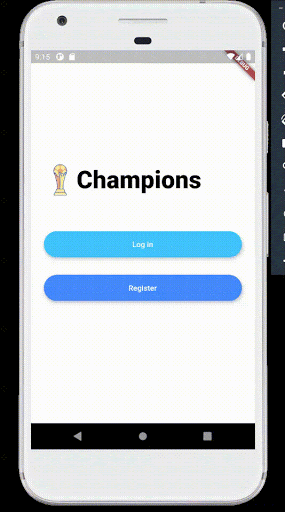

<<<<<<< HEAD
# championsChat
As a community challenge, we decided to make a chat app following the KISS (Keep It Simple, Stupid) philosophy. It should be ad free and easy to use.

## Table of contents

- [Overview](#overview)
  - [Screenshot](#screenshot)
- [My process](#my-process)
  - [Built with](#built-with)
- [Author](#author)
- [Acknowledgments](#acknowledgments)

## Overview

### The challenge

Users should be able to:

- Use the app

### Screenshot

## My process

### Built with

- Creativity
- [Google](https://www.google.com/) - Google searching

## Author

- Champion - [gnuion](https://github.com/gnuion)
- Christina - [christina-ml](https://github.com/christina-ml)

## Acknowledgments

Thanks, Champions Club!

**Note: Please, when I make the app available, use a unique password to register and don't share sensible information using it..**
=======
# champions_chat

A new Flutter application.

## Getting Started

This project is a starting point for a Flutter application.

A few resources to get you started if this is your first Flutter project:

- [Lab: Write your first Flutter app](https://flutter.dev/docs/get-started/codelab)
- [Cookbook: Useful Flutter samples](https://flutter.dev/docs/cookbook)

For help getting started with Flutter, view our
[online documentation](https://flutter.dev/docs), which offers tutorials,
samples, guidance on mobile development, and a full API reference.
>>>>>>> 6322b40c3cd29f3cc3b0c338b97911224d3cd655
